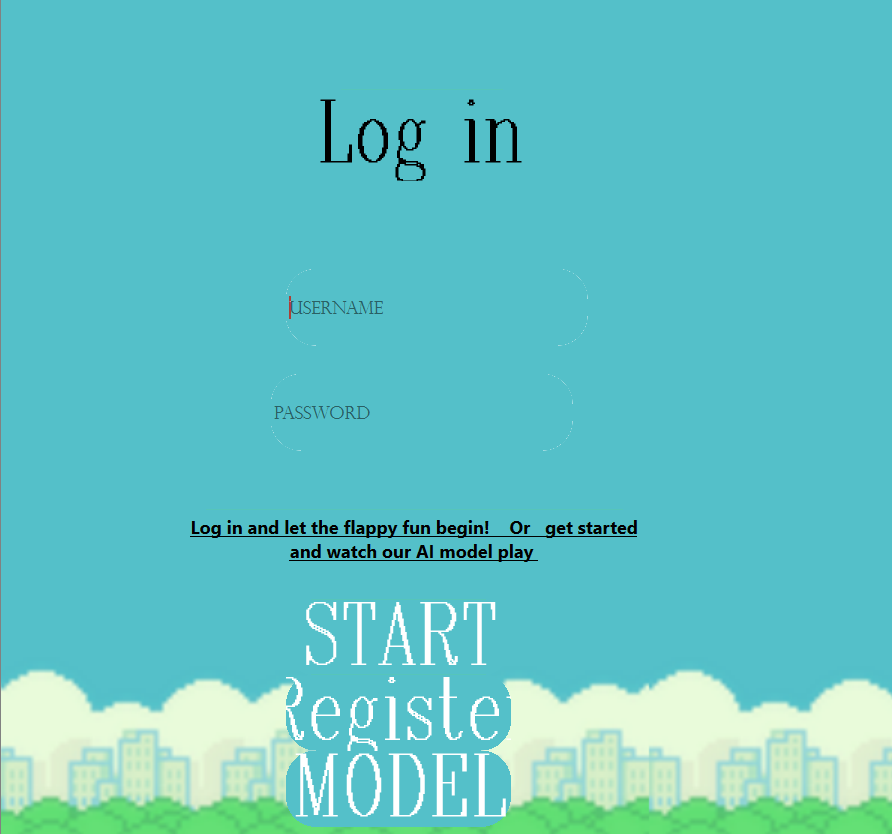
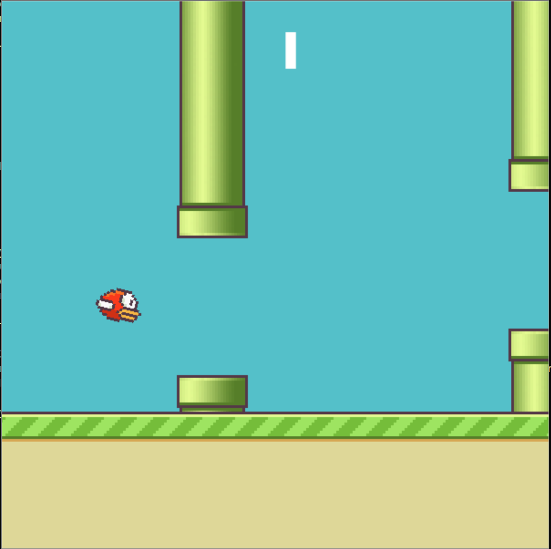
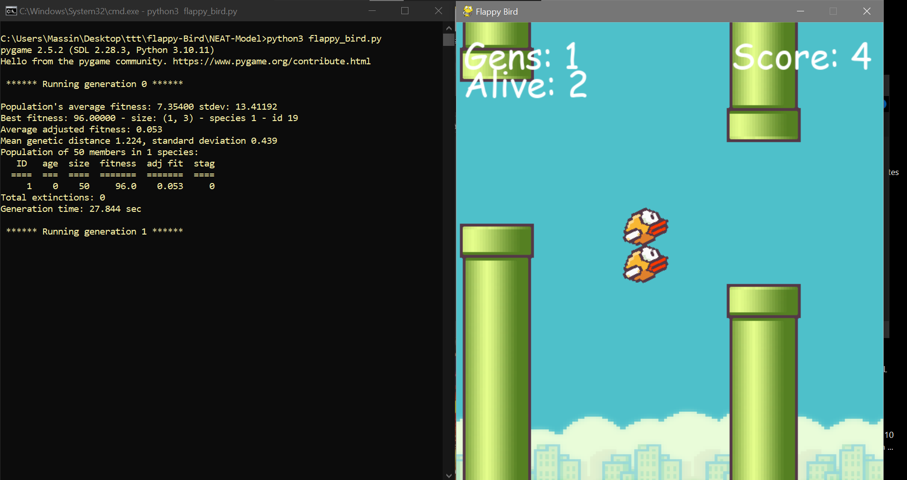
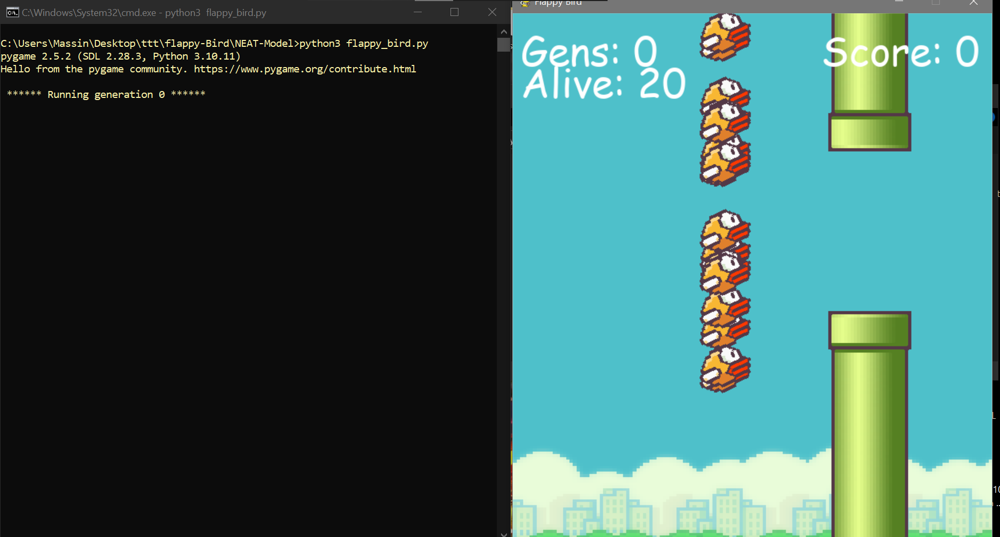

# Flappy Bird Game with AI and Database Integration

Welcome to the Flappy Bird Game project! This project includes the development of a Flappy Bird game using Python, Qt, and Pygame, with a login and registration interface linked to a database. Additionally, an AI model using the NEAT algorithm has been implemented to master the game.


## Features

- **Game Development**: Created using Python, Qt, and Pygame.
- **User Authentication**: Login and registration interface connected to a database.
- **Leaderboard**: Compete for the highest score among all players.
- **AI Integration**: Implemented NEAT algorithm to develop an AI model that can master the game.

## Installation

### Prerequisites

- Python 3.x
- PyQt5
- Pygame
- NEAT-Python
- Mysql (or any other database you prefer)

### Clone the Repository

```bash
git clone https://github.com/massinNiss/NEAT-Flappy-Bird.git
cd flappy-Bird
```
### Install Dependencies
    pip install -r requirements.txt
    
## Usage

  1-Navigate to the project directory.
  
  2-Run the main game script.
       
        python3 main.py


